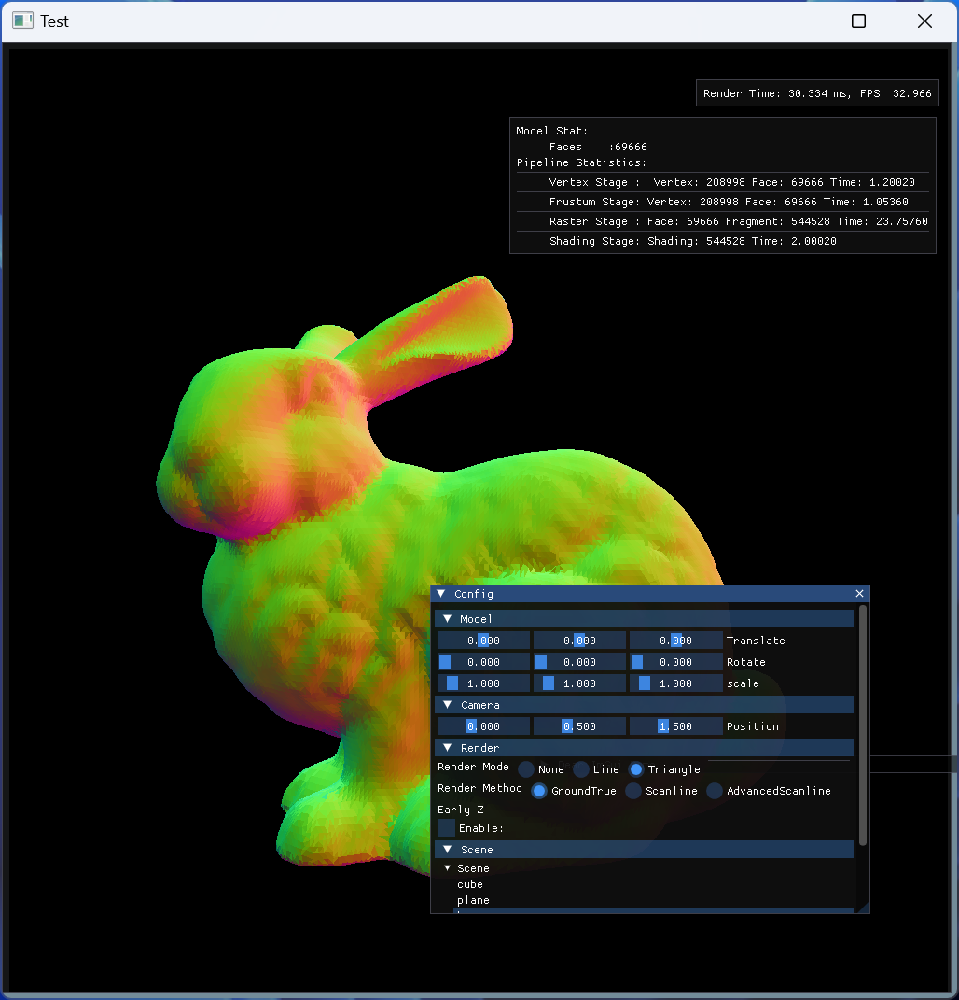

# 场景八叉树和层次Z-buffer

## 介绍和背景

去除场景中看不见的物体有个更现代的学名叫**剔除**（Occlusion），为此我没有特化光栅化管线，
而是在相对完整的传统光栅化管线之外通过插件形式实现各项功能，也方便测试改进的效率。

### 目的和内容

- 实现了简单软光栅流水线
- 实现基础扫描线Zbuffer
- 实现层次Z-Buffer
- 实现基于场景八叉树的视锥剔除和层次Z-Buffer剔除

## 算法和实现

### 光栅化管线

框架基于如下图所示的光栅化管线。

在着色阶段采用法线值以方便对比结果。

### 光栅化算法

实现可见`demo/raster/raster_method.cpp`

在光栅阶段可以选择不同的光栅化算法，在运行时切换。

#### GroundTruth 重心坐标

遍历三角形包围盒内像素，计算重心坐标。

#### 扫描线Z-buffer算法

将三角形分为上下两半，减少在三角形之外的像素点判断。
封装了Bresenham画线算法，使X/Y方向上坐标都是整数，尽可能避免浮点数误差。

### 层次Z Buffer

实现可见`demo/raster/hiez.cpp`

类似于Mipmap的做法，对深度图生成一系列LOD的保守深度值。

由于层次较多，实现的层次Z buffer单纯用于查询和剔除，不支持实时更新。因为对于宽为1024的图像来说，层次Z buffer的细节层数高达10层，实时更新引入巨大的额外开销。所以整体的做法类似UE的HZB，利用回读的上一帧深度信息建立HieZ。

> 当然相机位置的变换会使上一帧的深度信息过时，所以在变换时会出现一些黑影。
> 这通常可以通过重投影（reprojection）和图像空间滤波处理来获得更好的效果，但是由于是纯CPU管线，这些都非常影响效率。

在剔除的粒度上，管线中内置了一个层次Z Buffer用于视口空间下三角形的剔除。而在后续的八叉树节点也可以进行submesh粒度的剔除。

### 八叉树

实现可见`src/accelerator/octree.cpp`

#### 八叉树的建立

在加载场景时，对以submesh为单位的物体包围盒建立场景八叉树，所有的submesh会存储在八叉树的叶子节点中，并且所有包围盒有相交部分的叶子节点都会存储一份拷贝，而不是存储在中间节点中。这样虽然牺牲了一定的空间复杂度，但是可以在剔除时更有效率。

#### 八叉树视锥剔除和HieZ剔除

对于实时场景，视锥剔除是加速场景渲染的重要一步。

遍历八叉树，将树节点的AABB在模型空间变换后与相机的视锥测试。对相交的叶子节点内的submesh结点加入drawcall。

基于回传的层次Zbuffer，可以对八叉树节点进行深度剔除，这在大尺度遮挡的场景会比较有用（例如墙壁）。

## 实验与结果

### 测试环境

- 操作系统：Windows 11
- CPU：Ultra 7 155H
- 编译器：MSVC
- 分辨率 1024x1024

### 扫描线算法测试结果

对于需要绘制较大三角形的场景，scanline方法还是有比较大的优势——不需要遍历三角形外的点。但是对于范围较远的高模，
扫描线算法中active edge数组的操作非常影响效率，所以表现反而不好。

| 场景                                  | GroundTruth                                              | 扫描线                                                       | 加速比 |
| ------------------------------------- | -------------------------------------------------------- | ------------------------------------------------------------ | ------ |
| Cube  Verts:8 Faces:12          |  Raster Time: 42.83ms     |  Raster time: 38.35ms | 1.11   |
| Bunny Verts:208998  Face:69666  |  Raster Time: 23.75ms   |   Raster Time: 41.41ms            | 0.57   |
| House  Verts:346056 Face:115352 |                            |                              | 1.48   |
| Sponza Verts:786801 Face:262267 |  Raster Time: 108.93ms |  Raster Time: 61.74ms    | 1.77   |

### 剔除算法测试结果

#### 八叉树剔除

因为八叉树只是减少提交的drawcall中顶点和面的数量，所以用Sponza场景的线框模式来直观比较剔除的效率。

实际上Sponza只有380个submesh，规模并不算大。只是测试用。

| 参数             | 结果（fps） | 顶点与面数                       | 加速比 |
| ---------------- | ----------- | -------------------------------- | ------ |
| Ground Truth     | 85          |                                  | 1      |
| Octree (depth 3) | 102         | Vertex: 581697   Face: 193899 | 1.2    |
| Octree (depth 4) | 170         | Vertex: 226227   Face: 75409  | 2      |
| Octree (depth 5) | 170         | Vertex: 152244   Face: 50748  | 2      |

当八叉树的深度继续增加，对帧率的优化就是负收益了。

#### HieZ最有作用的场景

由于层次Zbuffer建立方式的保守，一般情况下，开放环境中，比较难以剔除屏幕中间的物体。因为会倾向于查询较高层的Zbuffer，且由于开放坏境，往往高层会有很多无意义的初始化值，从而难以剔除。

对于室内环境，有很多物体遮挡的情况下，层次Zbuffer的效果比较显著：

场景为Sponza，摄像机位置在其中一块窗帘后。

| 方法                                | 结果                              | 相关数据统计                         |
| ----------------------------------- | --------------------------------- | ------------------------------------ |
| 场景内容                            |   |                                      |
| 无HieZ                              |      | Faces: 45306 Raster Time:133.85ms |
| 管线中启用HieZ                      |     | Face:7264 Raster Time:79.98ms     |
| 启用Octree 不启用HieZ剔除及管线HieZ |  | 剔除后Drawcall中faces: 140053        |
| 启用Octree HieZ剔除及管线HieZ       |     | 剔除后Drawcall中faces: 136899        |

可以看到这种场景下层次z buffer的效果非常显著，在光栅化阶段之前就可以过滤掉大部分不可见三角形。
而对于Octree场景来说，因为过滤的粒度是submesh，所以加上Hiez的效果相对一般。

## 总结

虽然但是，还是学到许多，纠正了一些以前错误的观念。
